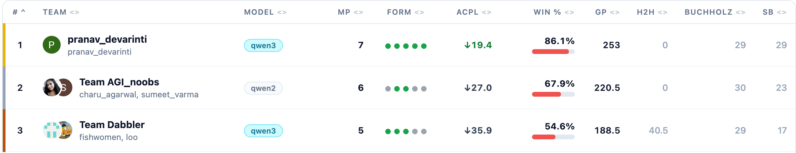

# 🏆 Qwen-ChessOracle: 3rd Place Solution for Global Chess Challenge 2025

[](https://www.aicrowd.com/challenges/global-chess-challenge-2025) []() []() []() [](https://huggingface.co/AshleyLuo/Qwen-ChessOracle) 

<!-- [](https://github.com/AshleyLuo001/-Global-Chess-Challenge-2025-AIcrowd-/stargazers) -->

This repository contains the full engineering pipeline and source code for **Qwen-ChessOracle**, the 3rd place winning solution for the [Global Chess Challenge 2025](https://www.aicrowd.com/challenges/global-chess-challenge-2025) hosted on AIcrowd.


## 💡 Solution Architecture

This approach frames chess move prediction as a sequence-to-sequence language modeling task. We fine-tuned the highly efficient **Qwen3-0.6B** model using the ModelScope SWIFT framework. 


Key innovations include:
1. **Spatial & Semantic Tokenizer Extension**: We fundamentally changed how the LLM "sees" the board. 64 board squares (`<a1>` to `<h8>`) and specific piece states (e.g., `<White_Pawn>`, `<blank>`) were registered as special tokens.
2. **Legal Move Prompts**: To guarantee valid syntax, the prompt explicitly injects all legal UCI moves for the current state.
3. **Automated Label Correction via PGN Analysis**: Game evaluations were parsed to identify blunders (NAGs 2, 4, 6). By applying RegEx on Lichess annotations (e.g., `"Nxe2+ was best"`), we dynamically replaced poor actual moves with the optimal moves for higher-quality supervision.

## 🔍 How the Model "Sees" the Board

Instead of feeding raw FEN strings, we translate the board state and legal moves into our custom tokenized format. Here is an example of the prompt structure:

**Input (Query):**
```xml
<chess_position>
<a1><White_Rook><b1><White_Knight>...<h8><Black_Rook>
|White|KQkq|-|0|1|
<e2><e4> <d2><d4> <g1><f3> ... (Legal Moves)
</chess_position>
```

**Output (Target Label):**
```xml
<think>one-sentence rationale</think>
<uci_move>e2e4</uci_move>
```


## 📊 Dataset

The training data is sourced from the official [Lichess Standard Chess Games](https://huggingface.co/datasets/Lichess/standard-chess-games) dataset (September 2025 partition). 
* Over 2.8 million raw games were parsed.
* Only decisive games (`1-0`, `0-1`, `1/2-1/2`) were kept.
* Multiprocessing was utilized to handle the massive PGN parsing overhead.


## 📂 Repository Structure
* `src/`: Python source code for data parsing, multiprocessing, and tokenizer modification.
* `scripts/`: Bash scripts to execute data caching and SFT training.
* `predict.py`: Inference script to load the trained model and predict the best move for a given FEN.
* `data/` & `models/`: Directories for raw parquets, features, and model checkpoints (ignored in `.gitignore`).

## 🛠️ Quick Start

### 1. Setup Environment
```bash
pip install -r requirements.txt
```

### 2. Feature Engineering & Tokenizer Prep
Generate the training dataset and expand the Qwen3 tokenizer:

> First, you can download the data we used by running the `data_load.py` script.

```bash
# 1. Run Data Processing (Parses PGNs into CSV format)
python src/data_processor.py

# 2. Setup Custom Tokenizer
python src/tokenizer_utils.py
```

### 3. Training pipeline
Build the cache and launch distributed training (e.g., using 8 GPUs):
```bash
bash scripts/run_export.sh
bash scripts/run_sft.sh
```

## 📥 Pre-trained Weights

We have open-sourced our fine-tuned model weights. You can directly download or load the model for inference without retraining:

👉 **[ChessOracle 0.8B](https://huggingface.co/AshleyLuo/Qwen-ChessOracle)**

You can load it directly via Transformers:
```python
from transformers import AutoModelForCausalLM, AutoTokenizer

model_name = "AshleyLuo/Qwen-ChessOracle"
tokenizer = AutoTokenizer.from_pretrained(model_name)
model = AutoModelForCausalLM.from_pretrained(model_name, device_map="auto")
```
## 🏆 Results

* **Final Rank:** 3rd Place (Bronze Medal) 🥉
